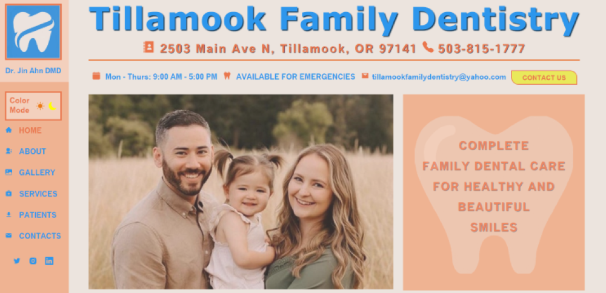
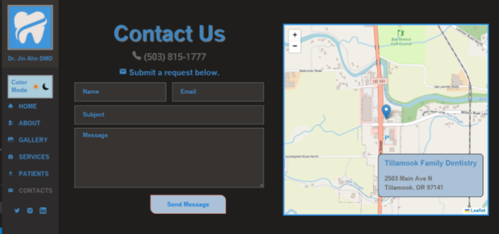

# Tillamook Family Dentistry (Capstone)

#### By Sue Roberts

####  React website for dentist office 

## Diagram

## Technologies Used
* React
* JavaScript
* HTML
* SCSS

## Description
 A user can choose the  light or dark mode  to  view the website.  They are able to see  dental  practice information that includes slide show, map and services offered by doctor & hygienist. They can also download patient forms and send email from the contact page.

## Project Images

#### Light Mode

  
  

#### Dark Mode

  
  

## Setup/Installation Requirements

* Clone repository: $ git clone https://github.com/SueRtx/Capstone.git   
* Navigate to "dentist": $ cd dentist   
* Open Vs Code: $ code .   
* Open TERMINAL in Vs Code
* Install dependencies: $ npm install
* Run Program: Go to terminal  → $ npm start run 
* Open web browser: http://localhost:3000/ (if web page does not open automatically) 

## Research & Planning Log

#### 11/5/2022 (weeek 1) ~7hrs
* 12:38 -- Researching how to make a website.
* 1:58  -- Start codecademy class: Build Website for your Business.
* 3:09  -- Still learnning how to build  a website. (review HTML)
* 4:16  -- Still learnning how to build a website. (review HTML)
* 5:51  -- Still learnning how to build a website. (review CSS)
* 9:00  -- Researching how to deploy a website.
* 9:30  -- Start codecademy class: How to Deploy a Website. (purchase a domain name)

#### 11/17/2022 (weeek 2) ~5hrs
* 11:40 -- Researching: Deploying C# & React Applications
* 12:30 -- Watching youtube video: React Website Tutorial
* 1:30  -- Start React Application
* 2:40  -- Working on website diagram
* 3:20  -- Add files and folders
* 4:13  -- WIP 

#### 12/6/2022 ~5hrs
* 10:15am - 02:00pm -- Research & working on code
* 06:00pm - 07:45pm -- Reserach & working on code 

#### 12/7/2022 ~3hrs
* 02:30pm - 03:30pm -- Research CSS & working on code
* 05:00pm - 06:00pm -- Reserach & working on code
* 08:00pm - 09:00pm -- Reserach & working on code

#### 12/8/2022 ~11hrs
* 07:45am - 10:00am -- Reserach & working on code
* 12:30pm - 04:30pm -- Reserach & working on code
* 06:30pm - 11:08pm -- Reserach & working on code

#### 12/9/2022 ~10hrs
* 08:27am - 12:00pm -- Reserach & working on code
* 02:18pm - 06:00pm -- Design logo & edit images
* 09:00pm - 11:45pm -- Reserach & working on code

#### 12/10/2022 ~10hrs
* 09:22am - 02:27pm -- Reserach & working on code
* 03:30pm - 07:45pm -- Reserach & working on code
* 09:00pm - 10:25pm -- Reserach & working on code

#### 12/11/2022 ~7hrs
* 11:15am - 12:10pm -- Reserach email.js
* 12:10pm - 03:00pm -- Reserach & working on code
* 04:00pm - 06:50pm -- Reserach & working on code

#### 12/12/2022 ~9hrs
* 10:37am - 02:19pm -- Reserach & working on code
* 03:30pm - 06:18pm -- Reserach & working on code
* 08:30pm - 11:04pm -- Reserach & working on code

#### 12/13/2022 ~9hrs
* 10:33am -  02:47pm -- Reserach & working on code
* 04:00pm -  05:58pm -- Reserach & working on code
* 08:00pm -  11:12pm -- Design logo  & working on code

#### 12/14/2022 ~7hrs
* 10:26am - 12:09am -- Reserach & working on code
* 08:00pm - 01:25pm -- Reserach & working on code

#### 12/15/2022 ~6hrs
* 09:03am - 10:34am  -- Reserach & working on code
* 08:00pm - 12:29pm -- Reserach & working on code

#### 12/16/2022 ~6hrs
* 09:08am - 10:34am  -- Reserach & working on code

#### 12/17/2022 
* 08:08am - 9:30am  -- Reserach & working on code
* 03:30pm - 05:00pm -- Reserach & working on code

## Known Bugs

* none

## License

MIT

Copyright (c) 2022 Sue Roberts

